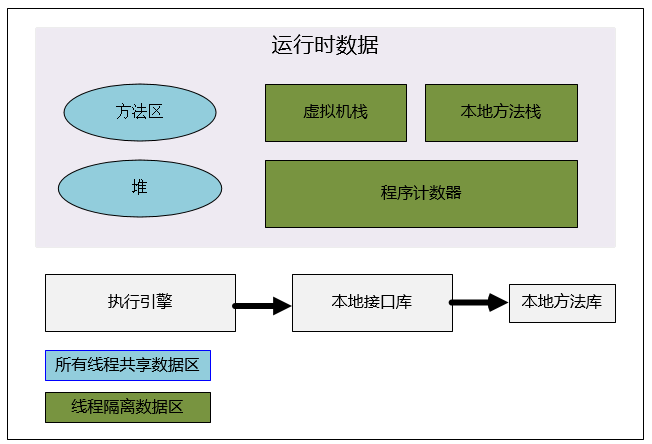

### alibabaJava开发规约

Eclipse版插件支持4.2（Juno，JDK1.8+）及以上版本，提供自主的Update Site，通过 Help >> Install New Software 然后输入https://p3c.alibaba.com/plugin/eclipse/update 即可看到安装列表

### Java面试准备

##### JVM内存管理机制和垃圾回收机制

##### 自动内存管理机制：

C++ 对应的new操作，要有free或者delete来释放内存。



Java虚拟机运行时内存区域。

- 1.程序计数器

程序计数器是一块较小的内存区域，它可以看作是当前线程所执行的字节码的行号指示器。字节码解释器工作时，通过改变这个计数器的值来取下一条执行的字节码指令。分支，循环，跳转，异常处理，线程恢复等。

是线程私有的内存。

如果线程正在执行一个方法，这个计数器记录的时正在执行虚拟机字节码指令的地址。如果正在执行Native方法，计数器值为空。

此内存区域时唯一一个Java虚拟机规范中没有规定任何OutOfMemoryError情况的区域。

- 2.Java虚拟机栈

Java虚拟机栈（Java Virtual Machine Stacks）也是线程私有的，它的生命周期与线程相同。栈用来存储局部变量表、操作数栈、动态链接、方法出口等信息。
每一个方法从调用直至执行完成的过程，就对应着一个栈帧在虚拟机栈中入栈到出栈的过程。

局部变量表存放了编译期可知的各种基本数据类型（boolean、byte、char、short、int、float、long、double）、对象引用（reference类型，它不等同于对象本身，可能是一个指向对象起始地址的引用指针，也可能是指向一个代表对象的句柄或其他与此对象相关的位置）和returnAddress类型（指向了一条字节码指令的地址）。64位长度的long和double类型的数据会占用2个局部变量空间（Slot），其余的数据类型只占用1个。

局部变量表所需的内存空间在编译期间完成分配，当进入一个方法时，这个方法需要在帧中分配多大的局部变量空间是完全确定的，在方法运行期间不会改变局部变量表的大小。

两种异常状况：如果线程请求的栈深度大于虚拟机所允许的深度，将抛出StackOverflowError异常；如果虚拟机栈可以动态扩展（当前大部分的Java虚拟机都可动态扩展，只不过Java虚拟机规范中也允许固定长度的虚拟机栈），如果扩展时无法申请到足够的内存，就会抛出OutOfMemoryError异常。

- 3.本地方法栈

本地方法栈（Native Method Stack）与虚拟机栈所发挥的作用是非常相似的，它们之间的区别不过是虚拟机栈为虚拟机执行Java方法（也就是字节码）服务，而本地方法栈则为虚拟机使用到的Native方法服务。

与虚拟机栈一样，本地方法栈区域也会抛出StackOverflowError和OutOfMemoryError异常。

- 4.Java堆

Java堆（Java Heap）是Java虚拟机所管理的内存中最大的一块。Java堆是被所有线程共享的一块内存区域，在虚拟机启动时创建。此内存区域的唯一目的就是存放对象实例，几乎所有的对象实例都在这里分配内存。

Java堆是垃圾收集器管理的主要区域，因此很多时候也被称做“GC堆”。

分代收集算法。所以Java堆中还可以细分为：新生代和老年代；再细致一点的有Eden空间、From Survivor空间、To Survivor空间等。

虚拟机都是按照可扩展来实现的（通过-Xmx和-Xms控制）。如果在堆中没有内存完成实例分配，并且堆也无法再扩展时，将会抛出OutOfMemoryError异常。

The heap is the runtime data area from which memory for all class instances and arrays is allocated。

- 5.方法区

方法区也是线程共享的内存区域。它用于存储已被虚拟机加载的类信息、常量、静态变量、即时编译器编译后的代码等数据。

方法区在HotSpot虚拟机上开发，又被称之为：永久区(Permanent Generation)。不好的设计，

根据Java虚拟机规范的规定，当方法区无法满足内存分配需求时，将抛出OutOfMemoryError异常。

- 6.运行时常量池

运行时常量池（Runtime Constant Pool）是方法区的一部分。Class文件中除了有类的版本、字段、方法、接口等描述信息外，还有一项信息是常量池（Constant Pool Table），用于存放编译期生成的各种字面量和符号引用，这部分内容将在类加载后进入方法区的运行时常量池中存放。


##### 对象的创建

虚拟机遇到一条new指令时，首先将去检查这个指令的参数是否能在常量池中定位到一个类的符号引用，并且检查这个符号引用代表的类是否已被加载、解析和初始化过。如果没有，那必须先执行相应的类加载过程。

分配内存：

指针碰撞 Bump the Pointer
空闲列表 Free List

### 垃圾回收机制

垃圾收集器及内存分配策略

如何判断一个对象是否已经不再使用，判断是否已死。

- 1.引用计数法。原因是它很难解决对象之间相互循环引用的问题。

```
objA.instance=objB;
objB.instance=objA;
```

对象objA和objB都有字段instance,除此之外，这两个对象再无任何引用，实际上这两个对象已经不可能再被访问，但是它们因为互相引用着对方，导致它们的引用计数都不为0，于是引用计数算法无法通知GC收集器回收它们。

- 2.可达性分析算法。

基本思路就是通过一系列的称为GC Roots的对象作为起始点，从这些节点开始向下搜索，搜索所走过的路径称为引用链(Reference Chain)，当一个对象到GC Roots没有任何引用链相连(用图论的话来说，就是从GCRoots到这个对象不可达)时，则证明此对象是不可用的。

#### 垃圾收回算法

- 标记-清除算法(Mark Sweep)
- 复制算法(Copying)
- 